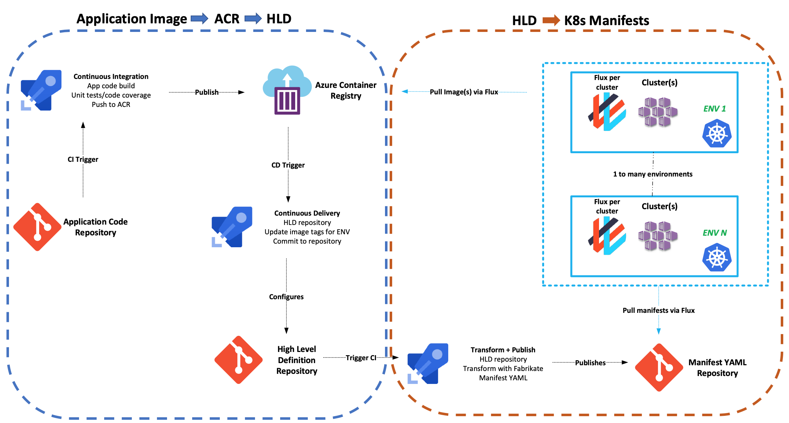
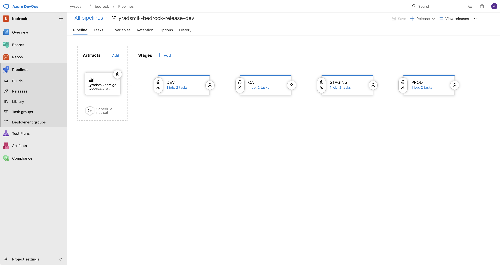
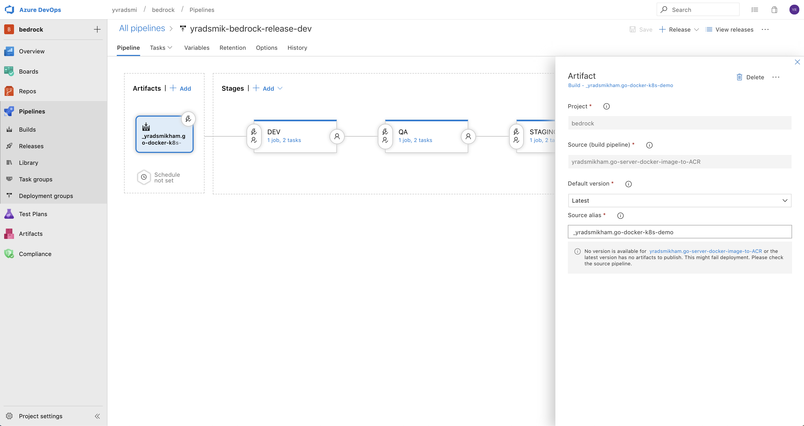
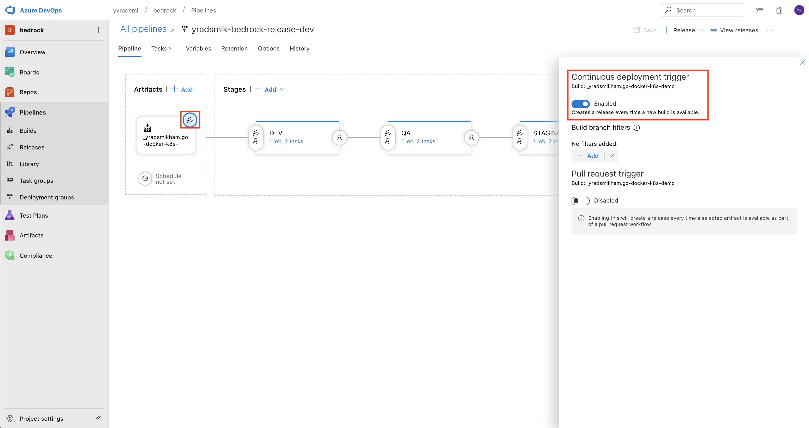
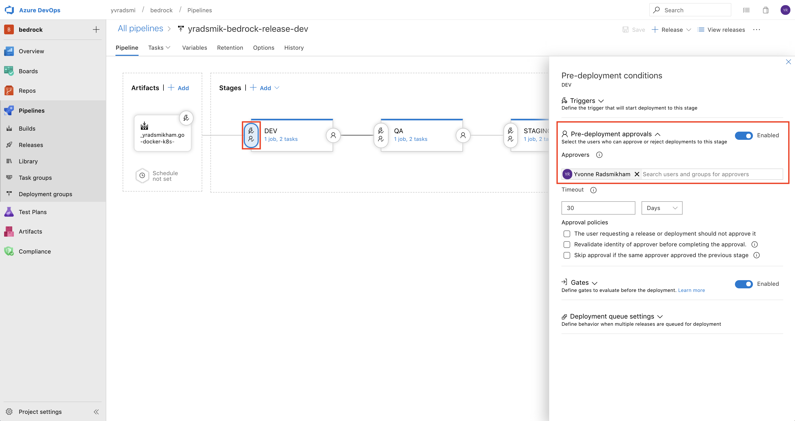
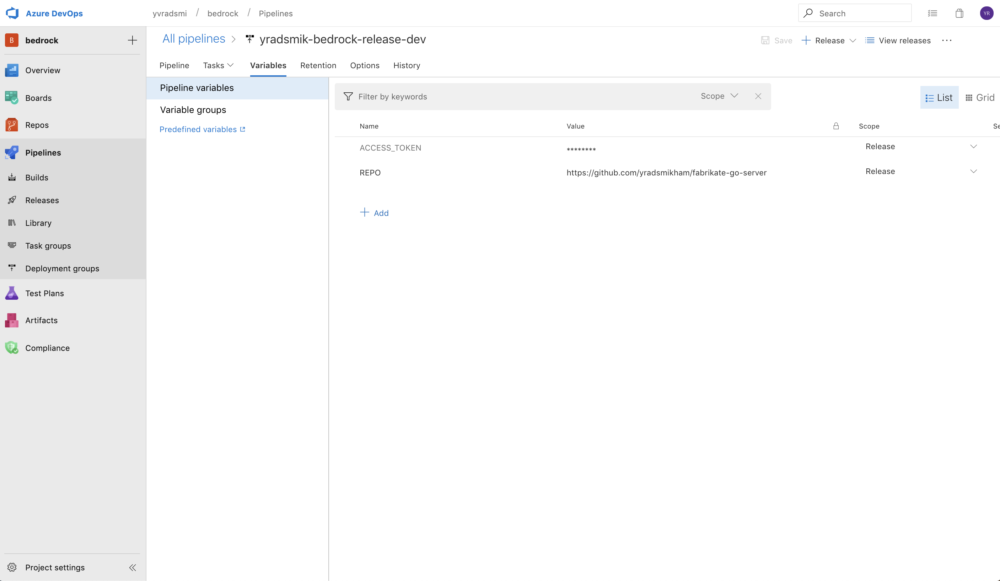
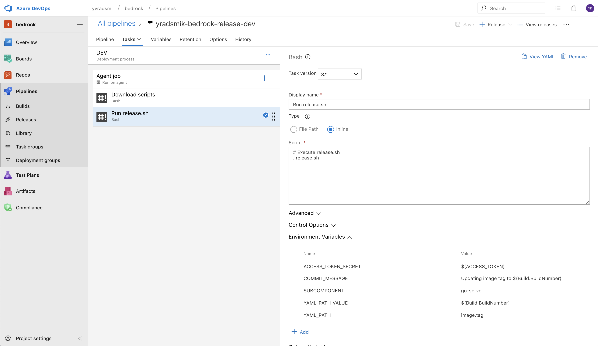

# Guide: Container Image Tag Release Pipeline
This section describes an example of how to extend your [manifest generation pipeline](PipelineThinking.md) by pre-prending a pipeline to automate incrementing your container image tag names in your high-level defintion using. Morever we cover a rudimentary way to perform container promotion with Azure DevOps.

We recommend following the guide to create a [manifest generation pipeline](README.md) with Azure DevOps first before attempting this scenario. 

## Prerequisites

1. _Permissions_: The ability to create Pipelines in your Azure DevOps Organization.
2. _High Level Deployment Description_: Either your own [Fabrikate](https://github.com/Microsoft/fabrikate) high level definition for your deployment or a sample one of ours.  We provide a [sample HLD repo](https://github.com/samiyaakhtar/aks-deploy-source) that builds upon the [cloud-native](https://github.com/timfpark/fabrikate-cloud-native) Fabrikate definition. The one used in this example can be found [here](https://github.com/yradsmikham/fabrikate-go-server).

## Setup

The GitOps workflow can be split into two components:

1. Application Pipeline -> High-Level Definition Image Tag Pipeline
2. Manifest Generation Pipeline

We will be focusing on the first step in this example.



## Application Pipeline -> High-Level Definition Image Tag Pipeline

### 1. Create Repositories and Personal Access Tokens

Create both high level definition (HLD) and resource manifest repos and the personal access tokens that you'll use for the two ends of this CI/CD pipeline.  We have instructions for how to do that in two flavors:
* [Azure DevOps](ADORepos.md)
* [GitHub](GitHubRepos.md)

### 2. Create Application Code Pipeline

Using Azure DevOps we created an Azure Pipelines YAML file that describes the build and Docker images publish to Azure Container Registry (ACR). Below is an example of this yaml pipelines.

```
trigger:
- master

pool:
  vmImage: 'Ubuntu-16.04'

variables:
  GOBIN:  '$(GOPATH)/bin' # Go binaries path
  GOROOT: '/usr/local/go1.11' # Go installation path
  GOPATH: '$(system.defaultWorkingDirectory)/gopath' # Go workspace path
  modulePath: '$(GOPATH)/src/github.com/$(build.repository.name)' # Path to the module's code

steps:
- script: |
    mkdir -p '$(GOBIN)'
    mkdir -p '$(GOPATH)/pkg'
    mkdir -p '$(modulePath)'
    shopt -s extglob
    shopt -s dotglob
    mv !(gopath) '$(modulePath)'
    echo '##vso[task.prependpath]$(GOBIN)'
    echo '##vso[task.prependpath]$(GOROOT)/bin'
  displayName: 'Set up the Go workspace'

- script: |
    go version
    go get -v -t -d ./...
    if [ -f Gopkg.toml ]; then
        curl https://raw.githubusercontent.com/golang/dep/master/install.sh | sh
        dep ensure
    fi
    docker run --rm -v "$PWD":/go/src/github.com/andrebriggs/goserver -w /go/src/github.com/andrebriggs/goserver iron/go:dev go build -ldflags "-X main.appVersion=$(build.BuildNumber)" -v -o bin/myapp
    az login --service-principal --username "$(SP_APP_ID)" --password "$(SP_PASS)" --tenant "$(SP_TENANT)"
    az acr build -r $(ACR_NAME) --image go-docker-k8s-demo:$(build.BuildNumber) .
  workingDirectory: '$(modulePath)'
  displayName: 'Get dependencies, build image, then publish to ACR'
```

This Azure Pipeline Build YAML file will be based on the application code that you are trying to build and deploy. The YAML shown is an example from: https://github.com/andrebriggs/go-docker-k8s-demo. You should create your own application that pushes your own container registry.

### 3. Add Environments to High Level Definition Repo 
Most Kubernetes deployments will utilize multiple _environments_. Our Bedrock GitOps process allows you to configure values for multiple environments. We can do this by adding (ENV_NAME).yaml files to the `config` directory of your high-level definition repository. 

<pre>
High-Level-Definition-Repo
├── azure-pipelines.yaml
├── config
│   ├── common.yaml
│   └── <b>DEV</b>.yaml
│   └── <b>QA</b>.yaml
│   └── <b>PROD</b>.yaml
│   └── <b>STAGING</b>.yaml
├── manifests
│   ├── ...
└── README.md
</pre>
In the example above notice we have a configuration for environments we have container promotion to occur on. You can see an example on a HLD repo [here](https://github.com/andrebriggs/fabrikate-go-server/tree/master/config). The environment names (**bolded**) match the names of Azure DevOps release pipeline stage we will cover next.

### 4. Create Azure Pipeline Release

The Azure Pipeline Release will be triggered off of the Azure Pipeline Build that was created in Step 2, and will accomplish the following objectives:

- Clone the HLD repo
- Download and Install Fabrikate
- Execute `fab set` to manipulate HLDs
- Git commit and push to HLD repo

The Release should look similar to the following, where updates to the build artifact will automatically trigger the execution of tasks within the stages. Here, the different stages in the pipeline resemble environments in your DevOps workflow.







Each stage should require manual approval from a specific user in order to proceed to the next stage.



The `ACCESS_TOKEN` and `REPO` variables are specifically used in the `build.sh`, which is sourced in the `release.sh`. As described before, the `ACCESS_TOKEN` is the Personal Access Token that grants access to your git account. In this case, the `REPO` variable is set to be the HLD repo.



The stages each involve two tasks: `Download scripts`, and `release.sh`. The `Download scripts` task downloads the `build.sh` and `release.sh` from the Microsoft/Bedrock repo.


The `Run release.sh` task will execute `release.sh` with the following environment variables:

```
ACCESS_TOKEN_SECRET: $(ACCESS_TOKEN)
COMMIT_MESSAGE: custom message used when committing and pushing to git
SUBCOMPONENT: the subcomponent within your Fabrikate HLD that should be manipulated
YAML_PATH: the yaml path to the subkey to set (e.g. data.replicas)
YAML_PATH_VALUE: the value to the subkey
```



After the Release runs successfully, the new application image that was generated in the Pipeline Build (Step #2) should now be referenced appropriately in the HLD.

### 5. Update Manifest Generation Pipeline To Be Environment Aware

Now that we have created a release pipeline with environment specific configurations we need to make sure that manifest generation pipeline knows to generate yaml for these environments. Below is a snippet from an example [azure-pipeline.yaml](https://github.com/andrebriggs/fabrikate-go-server/blob/master/azure-pipelines.yml) build file in a high-level definition repo. 

<pre>
 - task: ShellScript@2
    displayName: Transform fabrikate definitions and publish to YAML manifests to repo
    inputs:
      scriptPath: build.sh
    condition: 'ne(variables[''Build.Reason''], ''PullRequest'')'
    env:
      ACCESS_TOKEN_SECRET: $(ACCESS_TOKEN)
      COMMIT_MESSAGE: $(Build.SourceVersionMessage)
      REPO: $(MANIFEST_REPO)
      <b>FAB_ENVS: 'DEV,QA,STAGING WEST,STAGING EAST,STAGING CENTRAL,PROD WEST,PROD EAST,PROD CENTRAL'</b>
</pre>

The **bolded** key and values represent specific environments we want Fabrikate to generate yaml for. Notice that the comma delimited values contain a subset of the environment names we configured as Azure DevOps release pipeline stages and HLD repo configuration. 

Once we add the appropriate `FAB_ENVS` values the manifest generation pipeline will produce resource manifests for each directory

<pre>
Resource-Manifest-Repo
├── <b>DEV</b>
│   ├── ...
├── <b>QA</b>
│   ├── ...
├── <b>PROD</b>
│   ├── ...
├── <b>STAGE</b>
│   ├── ...
</pre>

Further reference:
+ [GitOps Pipeline Thinking](PipelineThinking.md)
+ [Manifest Generation Pipeline](README.md)
